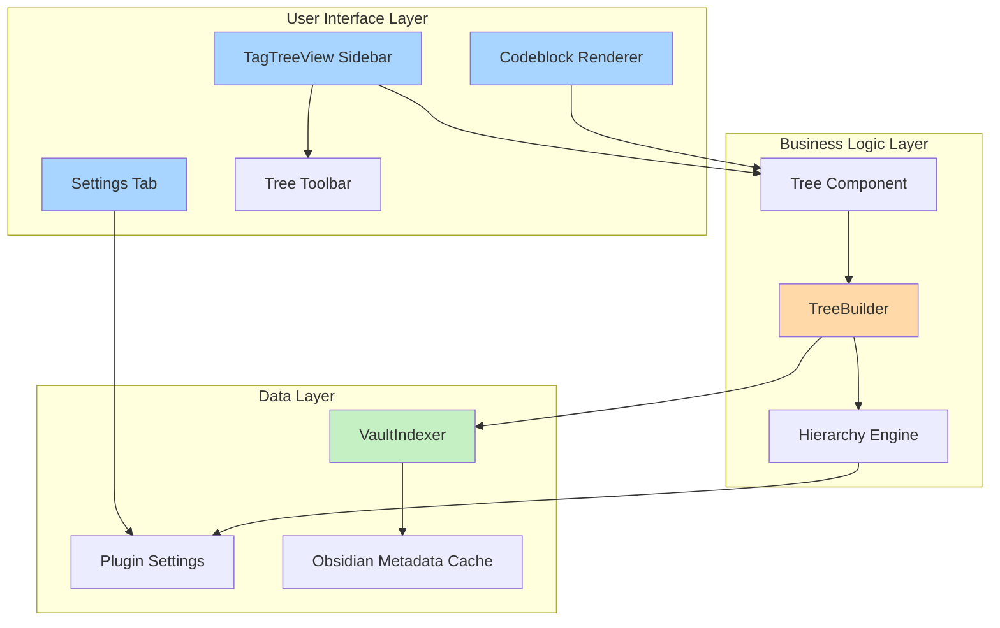

# Tag Tree Plugin — Detailed Implementation Plan

## Overview

This document provides a comprehensive implementation plan for the Obsidian Tag Tree plugin, building upon the vision outlined in [`vision.md`](docs/vision.md). The plan is organized into 7 phases, each containing specific technical tasks with architectural guidance.

## Current State

**Existing Code:**
- Basic plugin scaffolding in [`main.ts`](src/main.ts:1)
- Skeleton [`TagTreeView`](src/view.ts:5) with placeholder content
- Build configuration (Rollup + TypeScript)
- Testing setup (Vitest configured but no tests yet)

**Next Steps:**
Start with Phase 1 to build the foundational indexing and tree-building infrastructure.

---

## Phase 1: Foundations

### Objective
Build the core data layer that powers all tree views: index vault metadata, construct hierarchical trees from nested tags, and display basic tree structure in the sidebar.

### 1.1 Design and Implement VaultIndexer

**File:** `src/indexer/vault-indexer.ts`

**Responsibilities:**
- Index all tags and frontmatter from vault files
- Maintain reverse mappings (tag → files, property → value → files)
- Subscribe to Obsidian's metadata cache events for incremental updates
- Provide query methods for tree builders

**Core Interface:**
```typescript
interface VaultIndexer {
  // Index data structures
  tagToFiles: Map<string, Set<TFile>>;
  propertyToValueToFiles: Map<string, Map<string, Set<TFile>>>;
  fileToTags: Map<TFile, Set<string>>;
  fileToProperties: Map<TFile, Record<string, any>>;
  
  // Methods
  initialize(): Promise<void>;
  getFilesWithTag(tag: string): Set<TFile>;
  getFilesWithProperty(property: string, value?: string): Set<TFile>;
  getNestedTagsUnder(rootTag: string): string[];
  refresh(): Promise<void>;
}
```

**Implementation Notes:**
- Use `app.metadataCache.on('resolved', ...)` for incremental updates
- Use `app.metadataCache.on('changed', ...)` to handle file modifications
- Parse nested tags (e.g., `#a/b/c` → `['a', 'a/b', 'a/b/c']`)
- Cache results to avoid redundant processing

**Testing Strategy:**
- Unit tests with mock vault data
- Test incremental updates when files change
- Verify tag hierarchy parsing

---

### 1.2 Build Basic TreeBuilder for Nested Tag Hierarchies

**File:** `src/tree/tree-builder.ts`

**Responsibilities:**
- Transform flat tag index into hierarchical tree structure
- Support filtering by root tag
- Generate tree nodes with metadata (file count, children)

**Core Interface:**
```typescript
interface TreeNode {
  id: string;           // Unique identifier (e.g., tag path)
  name: string;         // Display name (leaf segment)
  type: 'tag' | 'file'; // Node type
  children: TreeNode[]; // Child nodes
  files: TFile[];       // Files at this level
  fileCount: number;    // Total files (including descendants)
}

interface TreeBuilder {
  buildFromTags(rootTag?: string): TreeNode;
  buildFromHierarchy(config: HierarchyConfig): TreeNode;
}
```

**Algorithm for Nested Tags:**
1. Get all tags from indexer (optionally filtered by root)
2. Split each tag by `/` into segments
3. Build tree structure by traversing segments
4. Attach files to leaf nodes
5. Calculate aggregate file counts

**Example:**
```
Tags: #project/alpha, #project/beta, #personal
Result:
- project (2 files)
  - alpha (1 file)
  - beta (1 file)
- personal (1 file)
```

---

### 1.3 Create Collapsible Tree UI Component

**File:** `src/components/tree-component.ts`

**Responsibilities:**
- Render tree nodes with collapse/expand icons
- Handle click events for navigation and toggling
- Maintain UI state (expanded/collapsed nodes)

**HTML Structure:**
```html
<div class="tag-tree-container">
  <div class="tree-node" data-node-id="project">
    <div class="tree-node-header">
      <span class="tree-collapse-icon">▼</span>
      <span class="tree-node-name">project</span>
      <span class="tree-node-count">2</span>
    </div>
    <div class="tree-node-children">
      <!-- Nested nodes -->
    </div>
  </div>
</div>
```

**State Management:**
```typescript
class TreeComponent {
  private expandedNodes: Set<string> = new Set();
  
  render(root: TreeNode, container: HTMLElement): void;
  toggleNode(nodeId: string): void;
  expandAll(): void;
  collapseAll(): void;
  expandToDepth(depth: number): void;
}
```

**Interactions:**
- Click node name → toggle expand/collapse
- Click collapse icon → toggle children visibility
- Click file name → open file in editor
- Hover → show tooltip with file count and metadata

---

### 1.4 Integrate VaultIndexer with TreeBuilder and Render

**File:** Update [`src/view.ts`](src/view.ts:5)

**Changes to TagTreeView:**
```typescript
export class TagTreeView extends ItemView {
  private indexer: VaultIndexer;
  private treeBuilder: TreeBuilder;
  private treeComponent: TreeComponent;
  
  async onOpen() {
    // Initialize indexer
    this.indexer = new VaultIndexer(this.app);
    await this.indexer.initialize();
    
    // Build tree
    this.treeBuilder = new TreeBuilder(this.indexer);
    const tree = this.treeBuilder.buildFromTags();
    
    // Render UI
    const container = this.containerEl.children[1];
    container.empty();
    this.treeComponent = new TreeComponent();
    this.treeComponent.render(tree, container);
  }
}
```

**File:** Update [`src/main.ts`](src/main.ts:4)
- No major changes needed yet
- Ensure view is properly registered

---

## Phase 2: Collapsible Tree & Sorting

### Objective
Add interactive controls for tree navigation and organization.

### 2.1 Implement Collapse/Expand State Management

**Enhancement:** Persist expand/collapse state across sessions

```typescript
interface ViewState {
  expandedNodes: string[];
  scrollPosition: number;
}

class TreeComponent {
  saveState(): ViewState;
  restoreState(state: ViewState): void;
}
```

**Storage:**
- Use `localStorage` or plugin settings
- Key by view name/ID

---

### 2.2 Add Sorting Controls

**Options:**
- Alphabetical (A-Z, Z-A)
- File count (most first, least first)
- Custom order (manual reordering in future)

**UI:**
```typescript
class TreeComponent {
  setSortMode(mode: 'alpha-asc' | 'alpha-desc' | 'count-desc' | 'count-asc'): void;
}
```

**Implementation:**
- Add sort function to TreeBuilder
- Apply recursively to all tree levels
- Update UI without rebuilding entire tree

---

### 2.3 Build Toolbar with Controls

**File:** `src/components/tree-toolbar.ts`

**Controls:**
- 🔽 Collapse All
- 🔼 Expand All  
- 🔢 Expand to Depth (dropdown: 1, 2, 3, All)
- 🔤 Sort (dropdown menu)

**Integration:**
```typescript
class TagTreeView {
  private toolbar: TreeToolbar;
  
  renderToolbar(container: HTMLElement): void {
    this.toolbar = new TreeToolbar({
      onCollapseAll: () => this.treeComponent.collapseAll(),
      onExpandAll: () => this.treeComponent.expandAll(),
      onExpandToDepth: (n) => this.treeComponent.expandToDepth(n),
      onSortChange: (mode) => this.treeComponent.setSortMode(mode),
    });
    this.toolbar.render(container);
  }
}
```

---

## Phase 3: Custom Hierarchy Engine

### Objective
Support user-defined multi-level grouping beyond simple tag hierarchies.

### 3.1 Define Hierarchy Configuration Schema

**File:** `src/types/hierarchy-config.ts`

```typescript
interface HierarchyLevel {
  type: 'tag' | 'property';
  key: string;          // Tag prefix or property name
  label?: string;       // Display name override
  sortBy?: SortMode;
}

interface HierarchyConfig {
  name: string;
  rootTag?: string;     // Optional filter
  levels: HierarchyLevel[];
  defaultExpanded?: number; // Default depth
}

// Example configuration:
const exampleConfig: HierarchyConfig = {
  name: "Projects by Status",
  rootTag: "#project",
  levels: [
    { type: 'property', key: 'project' },
    { type: 'tag', key: 'topic' },
    { type: 'property', key: 'status' }
  ],
  defaultExpanded: 2
};
```

---

### 3.2 Extend TreeBuilder to Support Property Grouping

**Enhancement to `TreeBuilder`:**

```typescript
class TreeBuilder {
  buildFromHierarchy(config: HierarchyConfig): TreeNode {
    let files = this.getAllFiles(config.rootTag);
    return this.buildLevel(files, config.levels, 0);
  }
  
  private buildLevel(
    files: TFile[], 
    levels: HierarchyLevel[], 
    depth: number
  ): TreeNode {
    if (depth >= levels.length) {
      return this.createFileNodes(files);
    }
    
    const level = levels[depth];
    const groups = this.groupBy(files, level);
    
    const children = groups.map(([key, groupFiles]) => ({
      id: `${depth}-${key}`,
      name: key,
      type: 'group',
      children: this.buildLevel(groupFiles, levels, depth + 1),
      files: [],
      fileCount: groupFiles.length
    }));
    
    return { id: 'root', name: 'Root', children, ... };
  }
  
  private groupBy(files: TFile[], level: HierarchyLevel): Map<string, TFile[]> {
    const groups = new Map();
    
    for (const file of files) {
      let key: string;
      
      if (level.type === 'property') {
        const metadata = this.indexer.fileToProperties.get(file);
        key = metadata?.[level.key] ?? 'Untagged';
      } else if (level.type === 'tag') {
        // Group by tag matching pattern
        key = this.findMatchingTag(file, level.key);
      }
      
      if (!groups.has(key)) groups.set(key, []);
      groups.get(key).push(file);
    }
    
    return groups;
  }
}
```

---

### 3.3 Create Settings Tab UI for Hierarchy Management

**File:** `src/settings/settings-tab.ts`

**UI Sections:**
1. **Saved Views List**
   - Display all configured views
   - Add/Edit/Delete buttons
   
2. **View Editor**
   - Name input
   - Root tag filter (optional)
   - Hierarchy levels builder:
     - Add level button
     - Drag to reorder
     - Configure type (tag/property)
     - Configure key/pattern

**Example UI Flow:**
```
┌─────────────────────────────────┐
│ Saved Views                     │
│ ✓ All Tags                      │
│   Projects by Status     [Edit] │
│   Research Topics        [Edit] │
│                                 │
│ [+ New View]                    │
└─────────────────────────────────┘

┌─────────────────────────────────┐
│ Edit View: "Projects by Status" │
│ Name: [Projects by Status     ] │
│ Root Tag: [#project           ] │
│                                 │
│ Hierarchy Levels:               │
│ 1. Property: project            │
│ 2. Tag: topic/*                 │
│ 3. Property: status             │
│ [+ Add Level]                   │
│                                 │
│ [Save] [Cancel]                 │
└─────────────────────────────────┘
```

**Implementation:**
```typescript
class TagTreeSettingsTab extends PluginSettingTab {
  display(): void {
    const { containerEl } = this;
    containerEl.empty();
    
    this.renderViewsList(containerEl);
    this.renderViewEditor(containerEl);
  }
  
  private renderViewsList(container: HTMLElement): void;
  private renderViewEditor(container: HTMLElement): void;
}
```

---

### 3.4 Implement Multi-Level Grouping Logic

**Testing:**
- Create test vault with sample data
- Define multi-level hierarchy
- Verify correct grouping and nesting
- Test edge cases (missing properties, no tags, etc.)

---

## Phase 4: Saved Views System

### Objective
Allow users to create, save, and switch between multiple tree configurations.

### 4.1 Implement View Persistence

**File:** `src/settings/plugin-settings.ts`

```typescript
interface TagTreeSettings {
  savedViews: HierarchyConfig[];
  activeViewId: string;
  viewStates: Record<string, ViewState>; // Per-view expand/collapse state
}

const DEFAULT_SETTINGS: TagTreeSettings = {
  savedViews: [
    {
      name: 'All Tags',
      levels: [{ type: 'tag', key: '' }]
    }
  ],
  activeViewId: 'All Tags',
  viewStates: {}
};

class TagTreePlugin extends Plugin {
  settings: TagTreeSettings;
  
  async loadSettings() {
    this.settings = Object.assign({}, DEFAULT_SETTINGS, await this.loadData());
  }
  
  async saveSettings() {
    await this.saveData(this.settings);
  }
}
```

---

### 4.2 Add View Switcher UI in Sidebar

**File:** Update `src/components/tree-toolbar.ts`

**Add Dropdown:**
```typescript
class TreeToolbar {
  private viewSelector: DropdownComponent;
  
  renderViewSelector(
    container: HTMLElement, 
    views: HierarchyConfig[],
    activeView: string,
    onChange: (viewId: string) => void
  ): void {
    new DropdownComponent(container)
      .addOptions(views.reduce((acc, v) => ({ ...acc, [v.name]: v.name }), {}))
      .setValue(activeView)
      .onChange(onChange);
  }
}
```

**Integration:**
```typescript
class TagTreeView extends ItemView {
  switchView(viewName: string): void {
    const config = this.plugin.settings.savedViews.find(v => v.name === viewName);
    if (!config) return;
    
    // Save current state
    this.saveViewState();
    
    // Rebuild tree with new config
    const tree = this.treeBuilder.buildFromHierarchy(config);
    this.treeComponent.render(tree, this.containerEl);
    
    // Restore state for new view
    this.restoreViewState(viewName);
  }
}
```

---

### 4.3 Create Commands for Quick View Switching

**File:** Update [`src/main.ts`](src/main.ts:4)

```typescript
class TagTreePlugin extends Plugin {
  async onload() {
    // ... existing code ...
    
    // Add command for each saved view
    this.settings.savedViews.forEach(view => {
      this.addCommand({
        id: `switch-to-${view.name.toLowerCase().replace(/\s+/g, '-')}`,
        name: `Switch to ${view.name} view`,
        callback: () => {
          const leaves = this.app.workspace.getLeavesOfType(VIEW_TYPE_TAG_TREE);
          leaves.forEach(leaf => {
            const view = leaf.view as TagTreeView;
            view.switchView(view.name);
          });
        }
      });
    });
  }
}
```

---

## Phase 5: Markdown Codeblock Rendering

### Objective
Enable embedding tree views directly inside notes using codeblocks.

### 5.1 Register Tagtree Codeblock Processor

**File:** Update [`src/main.ts`](src/main.ts:4)

```typescript
class TagTreePlugin extends Plugin {
  async onload() {
    // ... existing code ...
    
    this.registerMarkdownCodeBlockProcessor(
      'tagtree',
      this.processTagTreeBlock.bind(this)
    );
  }
  
  async processTagTreeBlock(
    source: string,
    el: HTMLElement,
    ctx: MarkdownPostProcessorContext
  ) {
    const processor = new TagTreeCodeblockProcessor(this.app, this);
    await processor.render(source, el, ctx);
  }
}
```

---

### 5.2 Parse Codeblock Parameters

**File:** `src/codeblock/codeblock-processor.ts`

**Supported Syntax:**

**Option 1: Reference saved view**
````markdown
```tagtree
view: "Projects by Status"
```
````

**Option 2: Inline configuration**
````markdown
```tagtree
root: #research
levels:
  - tag: "research"
  - property: "topic"
sort: alpha-asc
expanded: 2
```
````

**Parser Implementation:**
```typescript
interface CodeblockConfig {
  viewName?: string;
  root?: string;
  levels?: HierarchyLevel[];
  sort?: SortMode;
  expanded?: number;
}

class TagTreeCodeblockProcessor {
  parseConfig(source: string): CodeblockConfig {
    // Parse YAML-like syntax
    // Support both view references and inline configs
  }
  
  async render(source: string, el: HTMLElement, ctx: MarkdownPostProcessorContext) {
    const config = this.parseConfig(source);
    
    // Get or build hierarchy config
    const hierarchyConfig = config.viewName 
      ? this.plugin.settings.savedViews.find(v => v.name === config.viewName)
      : this.buildConfigFromParams(config);
    
    if (!hierarchyConfig) {
      el.createEl('div', { text: 'Invalid view configuration', cls: 'tag-tree-error' });
      return;
    }
    
    // Build and render tree
    const indexer = new VaultIndexer(this.app);
    await indexer.initialize();
    const builder = new TreeBuilder(indexer);
    const tree = builder.buildFromHierarchy(hierarchyConfig);
    
    const component = new TreeComponent();
    component.render(tree, el);
  }
}
```

---

### 5.3 Render Nested Lists with Proper Formatting

**Output Options:**

**Option A: Collapsible HTML**
```html
<details class="tag-tree-node" open>
  <summary>
    <span class="tag-tree-name">project</span>
    <span class="tag-tree-count">(2)</span>
  </summary>
  <ul>
    <li><details>...</details></li>
  </ul>
</details>
```

**Option B: Plain Nested List**
```html
<ul class="tag-tree">
  <li>
    <span>project (2)</span>
    <ul>
      <li><a href="...">Note 1</a></li>
      <li><a href="...">Note 2</a></li>
    </ul>
  </li>
</ul>
```

**Styling:** Add to `styles.css`

---

## Phase 6: Optimization & Advanced Features

### Objective
Ensure performance at scale and add polish.

### 6.1 Implement Incremental Index Updates

**Enhancement to VaultIndexer:**
```typescript
class VaultIndexer {
  private initialize() {
    this.app.metadataCache.on('changed', (file) => {
      this.updateFileIndex(file);
    });
    
    this.app.vault.on('delete', (file) => {
      this.removeFileFromIndex(file);
    });
    
    this.app.vault.on('rename', (file, oldPath) => {
      this.removeFileFromIndex(oldPath);
      this.updateFileIndex(file);
    });
  }
  
  private updateFileIndex(file: TFile): void {
    // Remove old entries
    this.removeFileFromIndex(file);
    
    // Add new entries
    const cache = this.app.metadataCache.getFileCache(file);
    // ... index tags and properties
    
    // Notify listeners
    this.trigger('index-updated', file);
  }
}
```

**Update TreeView to React:**
```typescript
class TagTreeView {
  async onOpen() {
    // ... initialize ...
    
    this.registerEvent(
      this.indexer.on('index-updated', () => {
        this.refreshTree();
      })
    );
  }
  
  private refreshTree(): void {
    const tree = this.treeBuilder.buildFromHierarchy(this.currentConfig);
    this.treeComponent.render(tree, this.containerEl);
  }
}
```

---

### 6.2 Add Performance Optimizations

**Strategies:**
1. **Lazy Rendering:** Only render visible nodes
2. **Virtual Scrolling:** For very large lists
3. **Debounced Updates:** Batch multiple metadata changes
4. **Memoization:** Cache tree structures when index hasn't changed

**Implementation Example:**
```typescript
class TreeComponent {
  private visibleNodes: Set<string> = new Set();
  
  render(root: TreeNode, container: HTMLElement): void {
    // Only render nodes that are expanded or at root level
    this.renderNode(root, container, 0);
  }
  
  private renderNode(node: TreeNode, parent: HTMLElement, depth: number): void {
    if (depth > 0 && !this.isExpanded(node.id)) {
      // Don't render collapsed children
      return;
    }
    
    // Render this node
    const el = this.createNodeElement(node);
    parent.appendChild(el);
    
    // Render children if expanded
    if (this.isExpanded(node.id)) {
      node.children.forEach(child => this.renderNode(child, el, depth + 1));
    }
  }
}
```

---

### 6.3 Implement Keyboard Navigation and Accessibility

**Keyboard Shortcuts:**
- `↑`/`↓`: Navigate between nodes
- `←`/`→`: Collapse/expand current node
- `Enter`: Open file
- `Space`: Toggle expand/collapse
- `Home`/`End`: Jump to first/last node

**Accessibility:**
- Add ARIA labels
- Support screen readers
- Proper focus management
- Tab navigation

**Implementation:**
```typescript
class TreeComponent {
  private setupKeyboardNav(container: HTMLElement): void {
    container.addEventListener('keydown', (e) => {
      switch(e.key) {
        case 'ArrowDown':
          this.focusNext();
          break;
        case 'ArrowUp':
          this.focusPrevious();
          break;
        case 'ArrowRight':
          this.expandFocused();
          break;
        case 'ArrowLeft':
          this.collapseFocused();
          break;
        case 'Enter':
          this.openFocused();
          break;
      }
    });
  }
}
```

---

## Phase 7: Polish & Release

### 7.1 Polish CSS Styling

**File:** Update `styles.css`

**Design Principles:**
- Match Obsidian's native styling
- Support both light and dark themes
- Smooth animations for expand/collapse
- Clear visual hierarchy

**Key Styles:**
```css
.tag-tree-container {
  padding: 8px;
  font-size: var(--font-ui-small);
}

.tree-node-header {
  display: flex;
  align-items: center;
  padding: 4px 8px;
  cursor: pointer;
  border-radius: 4px;
}

.tree-node-header:hover {
  background-color: var(--background-modifier-hover);
}

.tree-collapse-icon {
  margin-right: 4px;
  transition: transform 0.2s;
}

.tree-node.collapsed .tree-collapse-icon {
  transform: rotate(-90deg);
}

.tree-node-count {
  margin-left: auto;
  color: var(--text-muted);
  font-size: 0.9em;
}
```

---

### 7.2 Create Documentation

**Files to Create:**
- `README.md`: Plugin overview, installation, basic usage
- `docs/user-guide.md`: Detailed user documentation
- `docs/examples.md`: Sample configurations and use cases
- `docs/api.md`: Developer API (if exposing plugin API)

**Sample Views to Include:**
1. Simple tag hierarchy
2. Projects by status and topic
3. Research notes by field and year
4. Mixed tag + property grouping

---

### 7.3 Prepare for Release

**Checklist:**
- [ ] Update version in [`manifest.json`](manifest.json:4) and [`package.json`](package.json:3)
- [ ] Add comprehensive README
- [ ] Create release notes
- [ ] Test on multiple vault sizes
- [ ] Test on different Obsidian versions
- [ ] Verify no runtime dependencies
- [ ] Submit to Obsidian community plugins
- [ ] Set up GitHub releases workflow

**Release Process:**
1. Tag version: `git tag -a 1.0.0 -m "Initial release"`
2. Push tag: `git push origin 1.0.0`
3. GitHub Actions builds and creates release
4. Submit to Obsidian plugin registry

---

## Architecture Diagram



---

## File Structure

```
src/
├── main.ts                          # Plugin entry point
├── view.ts                          # Sidebar view
├── types/
│   ├── tree-node.ts                # TreeNode interface
│   ├── hierarchy-config.ts         # Configuration schema
│   └── view-state.ts               # UI state types
├── indexer/
│   └── vault-indexer.ts            # Metadata indexing
├── tree/
│   └── tree-builder.ts             # Tree construction logic
├── components/
│   ├── tree-component.ts           # Tree rendering component
│   └── tree-toolbar.ts             # Toolbar controls
├── codeblock/
│   └── codeblock-processor.ts      # Markdown processor
└── settings/
    ├── plugin-settings.ts          # Settings schema
    └── settings-tab.ts             # Settings UI

docs/
├── vision.md                        # Project vision
├── implementation-plan.md           # This document
├── user-guide.md                    # User documentation
└── examples.md                      # Sample configurations

tests/
├── indexer.test.ts
├── tree-builder.test.ts
└── tree-component.test.ts
```

---

## Testing Strategy

### Unit Tests
- **VaultIndexer:** Test tag parsing, property extraction, index updates
- **TreeBuilder:** Test hierarchy construction, sorting, filtering
- **TreeComponent:** Test rendering, state management, interactions

### Integration Tests
- **End-to-End:** Test full flow from index → tree → UI
- **Performance:** Test with large datasets (5k, 10k, 50k notes)
- **Edge Cases:** Empty vault, malformed metadata, circular references

### Manual Testing
- Test in real vaults of various sizes
- Verify UI responsiveness
- Test accessibility features
- Cross-platform testing (Windows, Mac, Linux, mobile)

---

## Key Design Decisions

### 1. **No External Dependencies**
- Use only Obsidian's built-in metadata cache
- Ensures compatibility and reduces maintenance burden

### 2. **Separation of Concerns**
- Indexing, tree building, and rendering are independent
- Easier to test, maintain, and extend

### 3. **Configuration Over Code**
- User-defined hierarchies instead of hardcoded logic
- More flexible and powerful for end users

### 4. **Incremental Updates**
- Listen to metadata changes and update index incrementally
- Avoids full vault re-indexing on every change

### 5. **Performance First**
- Designed for large vaults from the beginning
- Lazy rendering and virtual scrolling for scalability

---

## Next Steps

1. Review and approve this implementation plan
2. Begin Phase 1.1: Implement VaultIndexer
3. Set up testing infrastructure
4. Iterate through phases sequentially

Once you approve this plan, we can switch to Code mode to begin implementation.
