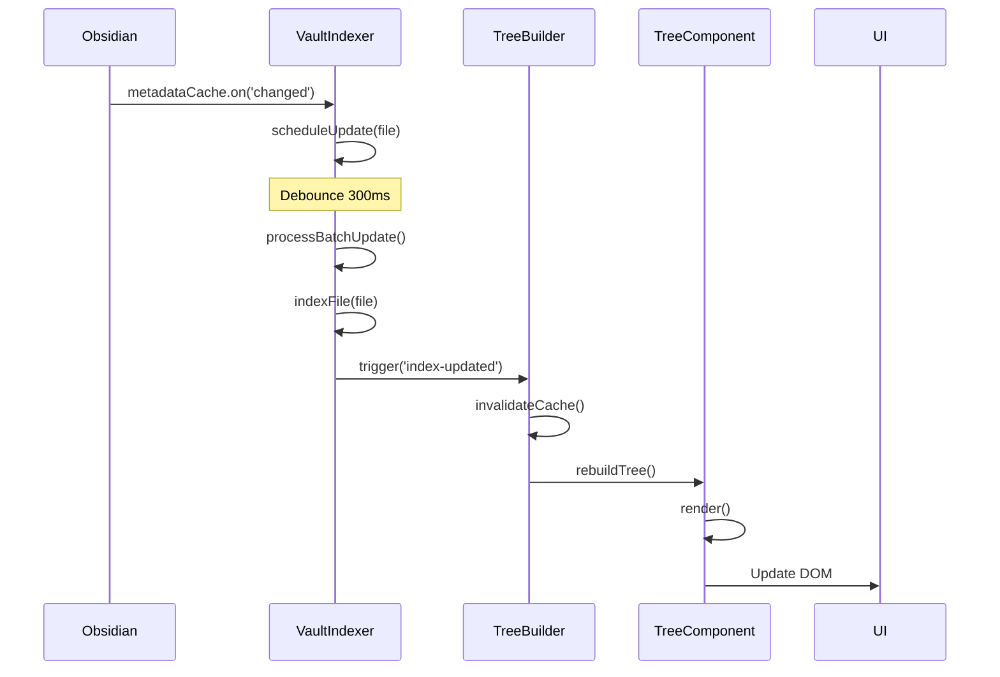

# Tag Tree Plugin — Technical Architecture

## Overview

This document provides detailed technical specifications for implementing the Obsidian Tag Tree plugin. It complements the [`implementation-plan.md`](docs/implementation-plan.md) with specific architectural decisions, data structures, and algorithms.

## Design Decisions Summary

Based on clarifications:

1. **No inline field support** - Focus on tags and frontmatter properties only
2. **Performance-first VaultIndexer** - Use Map/Set for O(1) lookups with caching
3. **Click behavior** - Tree nodes toggle expand/collapse (not file opening)
4. **Iterative development** - Start with Phase 1 basics, refine as needed

---

## Core Data Structures

### 1. VaultIndexer Data Model

**Primary Indices:**

```typescript
class VaultIndexer {
  // Tag → Files mapping (O(1) lookup)
  private tagToFiles: Map<string, Set<TFile>>;
  
  // Property → Value → Files mapping (nested O(1) lookup)
  private propertyToValueToFiles: Map<string, Map<string, Set<TFile>>>;
  
  // File → Tags mapping (reverse index)
  private fileToTags: Map<TFile, Set<string>>;
  
  // File → Properties mapping (reverse index)
  private fileToProperties: Map<TFile, Record<string, any>>;
  
  // Cached hierarchical tag data
  private tagHierarchyCache: Map<string, string[]>; // tag → all parent paths
  
  // Performance tracking
  private lastIndexTime: number;
  private fileCount: number;
}
```

**Cache Strategy:**

```typescript
// Example: Tag "#project/alpha/feature"
// Cached as:
tagHierarchyCache.set("project/alpha/feature", [
  "project",
  "project/alpha",
  "project/alpha/feature"
]);

// Enables fast queries like:
// - Get all tags under "project" → filter by startsWith("project/")
// - Get immediate children of "project" → filter by level depth
```

**Indexing Algorithm:**

```typescript
async function indexVault(): Promise<void> {
  const files = this.app.vault.getMarkdownFiles();
  
  for (const file of files) {
    await this.indexFile(file);
  }
  
  this.lastIndexTime = Date.now();
}

async function indexFile(file: TFile): Promise<void> {
  const cache = this.app.metadataCache.getFileCache(file);
  if (!cache) return;
  
  // Index tags
  const tags = new Set<string>();
  
  // From frontmatter tags
  if (cache.frontmatter?.tags) {
    const fmTags = Array.isArray(cache.frontmatter.tags) 
      ? cache.frontmatter.tags 
      : [cache.frontmatter.tags];
    fmTags.forEach(tag => tags.add(this.normalizeTag(tag)));
  }
  
  // From inline tags
  cache.tags?.forEach(tagCache => {
    tags.add(this.normalizeTag(tagCache.tag));
  });
  
  // Build hierarchical cache
  tags.forEach(tag => {
    const hierarchy = this.parseTagHierarchy(tag);
    this.tagHierarchyCache.set(tag, hierarchy);
    
    // Add to reverse mappings
    hierarchy.forEach(parentTag => {
      if (!this.tagToFiles.has(parentTag)) {
        this.tagToFiles.set(parentTag, new Set());
      }
      this.tagToFiles.get(parentTag)!.add(file);
    });
  });
  
  this.fileToTags.set(file, tags);
  
  // Index properties
  if (cache.frontmatter) {
    const props: Record<string, any> = {};
    
    for (const [key, value] of Object.entries(cache.frontmatter)) {
      if (key === 'tags' || key === 'position') continue; // Skip reserved
      
      props[key] = value;
      
      // Add to property index
      if (!this.propertyToValueToFiles.has(key)) {
        this.propertyToValueToFiles.set(key, new Map());
      }
      
      const valueMap = this.propertyToValueToFiles.get(key)!;
      const valueKey = String(value);
      
      if (!valueMap.has(valueKey)) {
        valueMap.set(valueKey, new Set());
      }
      valueMap.get(valueKey)!.add(file);
    }
    
    this.fileToProperties.set(file, props);
  }
}

function parseTagHierarchy(tag: string): string[] {
  // "#project/alpha/feature" → ["project", "project/alpha", "project/alpha/feature"]
  const normalized = tag.startsWith('#') ? tag.slice(1) : tag;
  const segments = normalized.split('/');
  const hierarchy: string[] = [];
  
  for (let i = 0; i < segments.length; i++) {
    hierarchy.push(segments.slice(0, i + 1).join('/'));
  }
  
  return hierarchy;
}

function normalizeTag(tag: string): string {
  // Remove leading # if present
  return tag.startsWith('#') ? tag.slice(1) : tag;
}
```

---

### 2. TreeNode Structure

```typescript
interface TreeNode {
  id: string;              // Unique identifier (full path or composite key)
  name: string;            // Display name (last segment)
  type: 'tag' | 'property-group' | 'file';
  
  // Hierarchy
  children: TreeNode[];
  parent?: TreeNode;       // Optional back-reference
  depth: number;           // Distance from root
  
  // Associated data
  files: TFile[];          // Files at this exact node
  fileCount: number;       // Total files (including descendants)
  
  // Metadata
  metadata?: {
    tagPath?: string;      // Full tag path for tag nodes
    propertyKey?: string;  // Property name for property nodes
    propertyValue?: any;   // Property value for property nodes
  };
  
  // UI state (managed by TreeComponent)
  isExpanded?: boolean;
}
```

**TreeNode Factory Functions:**

```typescript
function createTagNode(
  tagPath: string, 
  files: TFile[], 
  depth: number
): TreeNode {
  const segments = tagPath.split('/');
  const name = segments[segments.length - 1];
  
  return {
    id: `tag:${tagPath}`,
    name,
    type: 'tag',
    children: [],
    depth,
    files,
    fileCount: files.length,
    metadata: { tagPath }
  };
}

function createPropertyGroupNode(
  propertyKey: string,
  propertyValue: any,
  files: TFile[],
  depth: number
): TreeNode {
  return {
    id: `prop:${propertyKey}:${propertyValue}`,
    name: String(propertyValue),
    type: 'property-group',
    children: [],
    depth,
    files,
    fileCount: files.length,
    metadata: { propertyKey, propertyValue }
  };
}

function createFileNode(file: TFile, depth: number): TreeNode {
  return {
    id: `file:${file.path}`,
    name: file.basename,
    type: 'file',
    children: [],
    depth,
    files: [file],
    fileCount: 1
  };
}
```

---

### 3. TreeBuilder Algorithm

**Building from Nested Tags:**

```typescript
class TreeBuilder {
  constructor(private indexer: VaultIndexer) {}
  
  buildFromTags(rootTag?: string): TreeNode {
    // Get all tags (filtered by root if specified)
    const allTags = rootTag 
      ? this.indexer.getNestedTagsUnder(rootTag)
      : this.indexer.getAllTags();
    
    // Build tree structure
    const root: TreeNode = {
      id: 'root',
      name: 'Root',
      type: 'tag',
      children: [],
      depth: 0,
      files: [],
      fileCount: 0
    };
    
    const nodeMap = new Map<string, TreeNode>();
    nodeMap.set('root', root);
    
    // Sort tags by depth (parents before children)
    const sortedTags = allTags.sort((a, b) => {
      const depthA = a.split('/').length;
      const depthB = b.split('/').length;
      return depthA - depthB;
    });
    
    for (const tag of sortedTags) {
      const files = this.indexer.getFilesWithTag(tag);
      const segments = tag.split('/');
      const depth = segments.length;
      
      const node = createTagNode(tag, Array.from(files), depth);
      nodeMap.set(tag, node);
      
      // Find parent
      const parentTag = segments.slice(0, -1).join('/');
      const parent = parentTag ? nodeMap.get(parentTag) : root;
      
      if (parent) {
        parent.children.push(node);
        node.parent = parent;
      }
    }
    
    // Calculate aggregate file counts
    this.calculateFileCounts(root);
    
    return root;
  }
  
  private calculateFileCounts(node: TreeNode): number {
    let total = node.files.length;
    
    for (const child of node.children) {
      total += this.calculateFileCounts(child);
    }
    
    node.fileCount = total;
    return total;
  }
}
```

**Building from Hierarchy Config:**

```typescript
buildFromHierarchy(config: HierarchyConfig): TreeNode {
  // Get initial file set (filtered by root tag if specified)
  let files = config.rootTag
    ? Array.from(this.indexer.getFilesWithTag(config.rootTag))
    : this.app.vault.getMarkdownFiles();
  
  // Build tree recursively through hierarchy levels
  return this.buildLevelRecursive(files, config.levels, 0, 'root');
}

private buildLevelRecursive(
  files: TFile[],
  levels: HierarchyLevel[],
  depth: number,
  parentId: string
): TreeNode {
  // Base case: no more levels, create file nodes
  if (depth >= levels.length) {
    return {
      id: parentId,
      name: 'Files',
      type: 'file',
      children: files.map(f => createFileNode(f, depth + 1)),
      depth,
      files: [],
      fileCount: files.length
    };
  }
  
  const level = levels[depth];
  const groups = this.groupFilesByLevel(files, level);
  
  const children: TreeNode[] = [];
  
  for (const [groupKey, groupFiles] of groups.entries()) {
    const childId = `${parentId}:${groupKey}`;
    
    let node: TreeNode;
    
    if (level.type === 'tag') {
      node = createTagNode(groupKey, [], depth);
    } else if (level.type === 'property') {
      node = createPropertyGroupNode(level.key, groupKey, [], depth);
    }
    
    // Recursively build children
    const childNode = this.buildLevelRecursive(
      groupFiles,
      levels,
      depth + 1,
      childId
    );
    
    node.children = childNode.children;
    node.fileCount = groupFiles.length;
    
    children.push(node);
  }
  
  return {
    id: parentId,
    name: level.label || level.key,
    type: 'property-group',
    children,
    depth,
    files: [],
    fileCount: files.length
  };
}

private groupFilesByLevel(
  files: TFile[],
  level: HierarchyLevel
): Map<string, TFile[]> {
  const groups = new Map<string, TFile[]>();
  
  for (const file of files) {
    let groupKey: string;
    
    if (level.type === 'property') {
      const props = this.indexer.getFileProperties(file);
      groupKey = props[level.key] ?? '(none)';
    } else if (level.type === 'tag') {
      // Find tag matching the pattern
      const tags = this.indexer.getFileTags(file);
      const matchingTag = Array.from(tags).find(t => 
        t.startsWith(level.key) || level.key === ''
      );
      groupKey = matchingTag || '(untagged)';
    }
    
    if (!groups.has(groupKey)) {
      groups.set(groupKey, []);
    }
    groups.get(groupKey)!.push(file);
  }
  
  return groups;
}
```

---

## Performance Optimizations

### 1. Debounced Index Updates

```typescript
class VaultIndexer {
  private updateQueue: Set<TFile> = new Set();
  private updateTimer: NodeJS.Timeout | null = null;
  private readonly DEBOUNCE_MS = 300;
  
  private scheduleUpdate(file: TFile): void {
    this.updateQueue.add(file);
    
    if (this.updateTimer) {
      clearTimeout(this.updateTimer);
    }
    
    this.updateTimer = setTimeout(() => {
      this.processBatchUpdate();
    }, this.DEBOUNCE_MS);
  }
  
  private async processBatchUpdate(): Promise<void> {
    const filesToUpdate = Array.from(this.updateQueue);
    this.updateQueue.clear();
    
    for (const file of filesToUpdate) {
      await this.indexFile(file);
    }
    
    this.trigger('index-updated');
  }
}
```

### 2. Lazy Tree Rendering

```typescript
class TreeComponent {
  private renderCache: Map<string, HTMLElement> = new Map();
  
  renderNode(node: TreeNode, container: HTMLElement): void {
    // Check cache
    if (this.renderCache.has(node.id)) {
      const cached = this.renderCache.get(node.id)!;
      container.appendChild(cached);
      return;
    }
    
    // Create element
    const el = this.createNodeElement(node);
    
    // Only render children if expanded
    if (node.isExpanded && node.children.length > 0) {
      const childContainer = el.createDiv('tree-node-children');
      node.children.forEach(child => this.renderNode(child, childContainer));
    }
    
    // Cache for reuse
    this.renderCache.set(node.id, el);
    container.appendChild(el);
  }
  
  toggleNode(nodeId: string): void {
    // Clear cache for this node to force re-render
    this.renderCache.delete(nodeId);
    this.render(); // Re-render entire tree (or use targeted update)
  }
}
```

### 3. Memoized Tree Building

```typescript
class TreeBuilder {
  private treeCache: Map<string, TreeNode> = new Map();
  private cacheKeys: Map<string, string> = new Map(); // config → hash
  
  buildFromHierarchy(config: HierarchyConfig): TreeNode {
    const cacheKey = this.hashConfig(config);
    
    if (this.treeCache.has(cacheKey)) {
      return this.treeCache.get(cacheKey)!;
    }
    
    const tree = this.buildLevelRecursive(/* ... */);
    this.treeCache.set(cacheKey, tree);
    
    return tree;
  }
  
  invalidateCache(): void {
    this.treeCache.clear();
  }
  
  private hashConfig(config: HierarchyConfig): string {
    return JSON.stringify({
      name: config.name,
      rootTag: config.rootTag,
      levels: config.levels,
      timestamp: this.indexer.getLastIndexTime()
    });
  }
}
```

---

## UI Component Architecture

### TreeComponent Rendering

```typescript
class TreeComponent {
  private container: HTMLElement;
  private expandedNodes: Set<string> = new Set();
  private app: App;
  
  render(tree: TreeNode, container: HTMLElement): void {
    this.container = container;
    container.empty();
    
    const treeContainer = container.createDiv('tag-tree-container');
    
    this.renderNodeRecursive(tree, treeContainer);
  }
  
  private renderNodeRecursive(
    node: TreeNode,
    parent: HTMLElement,
    isRoot = false
  ): void {
    if (isRoot && node.id === 'root') {
      // Don't render root node itself, just children
      node.children.forEach(child => 
        this.renderNodeRecursive(child, parent, false)
      );
      return;
    }
    
    const nodeEl = parent.createDiv('tree-node');
    nodeEl.dataset.nodeId = node.id;
    nodeEl.dataset.nodeType = node.type;
    
    // Header
    const header = nodeEl.createDiv('tree-node-header');
    
    // Collapse icon (only if has children)
    if (node.children.length > 0) {
      const icon = header.createSpan('tree-collapse-icon');
      icon.textContent = this.isExpanded(node.id) ? '▼' : '▶';
      
      icon.addEventListener('click', (e) => {
        e.stopPropagation();
        this.toggleNode(node.id);
      });
    } else {
      header.createSpan('tree-collapse-icon-placeholder');
    }
    
    // Node name
    const nameEl = header.createSpan('tree-node-name');
    nameEl.textContent = node.name;
    
    // Click handler for node name
    header.addEventListener('click', () => {
      if (node.type === 'file') {
        this.openFile(node.files[0]);
      } else {
        this.toggleNode(node.id);
      }
    });
    
    // File count
    if (node.fileCount > 0 && node.type !== 'file') {
      const count = header.createSpan('tree-node-count');
      count.textContent = `(${node.fileCount})`;
    }
    
    // Children (if expanded)
    if (this.isExpanded(node.id) && node.children.length > 0) {
      const childrenContainer = nodeEl.createDiv('tree-node-children');
      node.children.forEach(child => 
        this.renderNodeRecursive(child, childrenContainer, false)
      );
    }
    
    // Add collapsed class if needed
    if (!this.isExpanded(node.id)) {
      nodeEl.addClass('collapsed');
    }
  }
  
  private toggleNode(nodeId: string): void {
    if (this.expandedNodes.has(nodeId)) {
      this.expandedNodes.delete(nodeId);
    } else {
      this.expandedNodes.add(nodeId);
    }
    
    // Re-render (could be optimized to only update affected node)
    this.render(this.currentTree, this.container);
  }
  
  private isExpanded(nodeId: string): boolean {
    return this.expandedNodes.has(nodeId);
  }
  
  private async openFile(file: TFile): Promise<void> {
    const leaf = this.app.workspace.getLeaf(false);
    await leaf.openFile(file);
  }
}
```

---

## State Management

### ViewState Persistence

```typescript
interface ViewState {
  expandedNodes: string[];
  scrollPosition: number;
  sortMode: SortMode;
}

class TagTreeView extends ItemView {
  saveViewState(): ViewState {
    return {
      expandedNodes: Array.from(this.treeComponent.getExpandedNodes()),
      scrollPosition: this.containerEl.scrollTop,
      sortMode: this.currentSortMode
    };
  }
  
  restoreViewState(state: ViewState): void {
    this.treeComponent.setExpandedNodes(new Set(state.expandedNodes));
    this.treeComponent.setSortMode(state.sortMode);
    this.containerEl.scrollTop = state.scrollPosition;
  }
  
  async onClose(): Promise<void> {
    // Save state before closing
    const state = this.saveViewState();
    const viewName = this.currentView?.name || 'default';
    
    this.plugin.settings.viewStates[viewName] = state;
    await this.plugin.saveSettings();
  }
}
```

---

## Event Flow

### Metadata Change → UI Update



---

## Error Handling

### Robust Indexing

```typescript
class VaultIndexer {
  async indexFile(file: TFile): Promise<void> {
    try {
      const cache = this.app.metadataCache.getFileCache(file);
      
      if (!cache) {
        console.warn(`[TagTree] No cache for file: ${file.path}`);
        return;
      }
      
      // Index with validation
      this.indexTags(file, cache);
      this.indexProperties(file, cache);
      
    } catch (error) {
      console.error(`[TagTree] Error indexing file ${file.path}:`, error);
      // Don't throw - continue indexing other files
    }
  }
  
  private indexTags(file: TFile, cache: CachedMetadata): void {
    try {
      const tags = new Set<string>();
      
      // Safely handle frontmatter tags
      if (cache.frontmatter?.tags) {
        const fmTags = Array.isArray(cache.frontmatter.tags)
          ? cache.frontmatter.tags
          : [cache.frontmatter.tags];
        
        fmTags.forEach(tag => {
          if (typeof tag === 'string') {
            tags.add(this.normalizeTag(tag));
          }
        });
      }
      
      // Safely handle inline tags
      cache.tags?.forEach(tagCache => {
        if (tagCache.tag) {
          tags.add(this.normalizeTag(tagCache.tag));
        }
      });
      
      this.fileToTags.set(file, tags);
      
    } catch (error) {
      console.error(`[TagTree] Error indexing tags for ${file.path}:`, error);
    }
  }
}
```

---

## Testing Infrastructure

### Mock Data Generators

```typescript
// tests/helpers/mock-vault.ts

export function createMockFile(
  path: string,
  tags: string[],
  properties: Record<string, any>
): TFile {
  return {
    path,
    basename: path.split('/').pop()!.replace('.md', ''),
    // ... other TFile properties
  } as TFile;
}

export function createMockVault(files: Array<{
  path: string;
  tags: string[];
  properties: Record<string, any>;
}>): TFile[] {
  return files.map(f => createMockFile(f.path, f.tags, f.properties));
}

// Usage in tests:
const mockVault = createMockVault([
  {
    path: 'Project Alpha.md',
    tags: ['#project/alpha', '#status/active'],
    properties: { priority: 'high', assignee: 'Alice' }
  },
  {
    path: 'Project Beta.md',
    tags: ['#project/beta', '#status/planning'],
    properties: { priority: 'medium', assignee: 'Bob' }
  }
]);
```

---

## Summary

This architecture provides:

1. **Efficient indexing** with Map/Set data structures and caching
2. **Flexible tree building** supporting tags and properties
3. **Performance optimization** through debouncing, lazy rendering, and memoization
4. **Robust error handling** to prevent crashes
5. **Clear separation** between data, logic, and UI layers

The implementation is ready to scale from small personal vaults to large knowledge bases with 50k+ notes.

---

**Next:** Review this architecture, then proceed to Phase 1 implementation starting with [`VaultIndexer`](src/indexer/vault-indexer.ts).